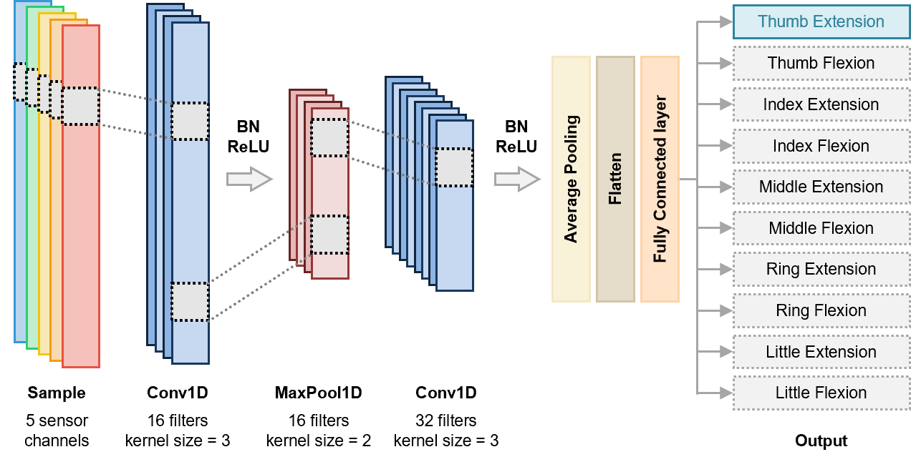

# Wrist-TDCNN Interaction

#### Lightweight wearable-sensor classification and real-time BLE cursor interaction

## Overview

This repository contains the training and evaluation code for a compact one-dimensional convolutional neural network (1D-CNN) for wearable-sensor gesture classification, together with a Bluetooth Low Energy (BLE) cursor-control demonstration.

| Workflow | Model input | Output | Checkpoint |
|---|---:|---:|---|
| Offline flexion/extension classification | 5 channels × 12 time steps | 10 classes | `checkpoints/released/best_model_classification.pth` |
| Real-time cursor control | 2 channels × 12 time steps | 4 classes: rest, left, right, pinch | `checkpoints/released/best_model_cursor_control.pth` |

The two workflows use separate model definitions and checkpoints. Released manuscript checkpoints are stored in `checkpoints/released/`, and checkpoints generated by classification training are stored in `checkpoints/trained/`.

## Repository structure

```text
wrist-tdcnn-interaction/
├── README.md
├── environments.yaml
├── LICENSE
├── assets/
│   ├── background.png
│   ├── chrome.png
│   ├── cursor.png
│   └── model_architecture.png
├── checkpoints/
│   ├── released/
│   │   ├── best_model_classification.pth
│   │   └── best_model_cursor_control.pth
│   └── trained/
├── configs/
│   ├── flexion_extension_classification_parameters.py
│   └── cursor_control_parameters.py
├── models/
│   ├── flexion_extension_classification_model.py
│   └── ultralight_model.py
├── preprocessing/
│   ├── flexion_extension_classification_preprocessing.py
│   └── cursor_control_preprocessing.py
├── pipelines/
│   ├── flexion_extension_classification_train.py
│   ├── flexion_extension_classification_offline_inference.py
│   └── cursor_control.py
└── examples/
    ├── data_classification/
    │   ├── train/
    │   ├── valid/
    │   └── test/
    └── raw_data_cursor_control.csv
```

## Setup

```bash
git clone <REPOSITORY_URL>
cd wrist-tdcnn-interaction
conda env create -f environments.yaml
conda activate <ENVIRONMENT_NAME>
```

All commands are executed from the repository root. Set the repository root on `PYTHONPATH` before running the pipeline scripts directly.

Linux or macOS:

```bash
export PYTHONPATH="$(pwd)"
```

Windows PowerShell:

```powershell
$env:PYTHONPATH = (Get-Location).Path
```

PyTorch uses CUDA automatically when a compatible GPU is available and otherwise runs on the CPU.

## Classification data

Classification CSV files are organized as follows:

```text
examples/data_classification/train/
examples/data_classification/valid/
examples/data_classification/test/
```

Each CSV file contains:

```text
Counts, GestureIdentifier, Thumb, Index, Middle, Ring, Little
```

The preprocessing pipeline applies per-channel min–max normalization, creates 120-sample windows with stride 1, divides each window into 10-sample blocks, and calculates a trimmed mean after removing the three smallest and three largest values from each block. Each input window is therefore converted to a `5 × 12` tensor.

Gesture identifiers are mapped to class indices as follows:

```text
51→0, 52→1, 61→2, 62→3, 71→4,
72→5, 81→6, 82→7, 91→8, 92→9
```

Dataset paths, preprocessing parameters, and training hyperparameters are defined in `configs/flexion_extension_classification_parameters.py`.

## Classification training

```bash
python pipelines/flexion_extension_classification_train.py
```

The principal output is:

```text
checkpoints/trained/best_model_classification.pth
```

<p align="center">
  
</p>
<p align="center">
  <em>Figure 1. Architecture of the compact 1D-CNN classification model.</em>
</p>

The best checkpoint is updated whenever validation accuracy matches or exceeds the previous best value. Repeated training runs overwrite files with the same names in `checkpoints/trained/`.

The training pipeline also stores models that reach the configured early-stopping threshold as:

```text
checkpoints/trained/top_model_<accuracy>_<epoch>.pth
```

An interrupted run is stored as:

```text
checkpoints/trained/interrupted_model_epoch_<epoch>.pth
```

## Offline classification evaluation

The default evaluation uses the released manuscript checkpoint:

```text
checkpoints/released/best_model_classification.pth
```

```bash
python pipelines/flexion_extension_classification_offline_inference.py
```

The checkpoint generated by classification training is evaluated with:

```bash
python pipelines/flexion_extension_classification_offline_inference.py --checkpoint checkpoints/trained/best_model_classification.pth
```

The evaluation dataset is read from `examples/data_classification/test/`.

## Real-time cursor control

BLE connection settings and selected sensor channels are defined in `configs/cursor_control_parameters.py`:

```python
ble_characteristic_uuid = "YOUR_BLE_DEVICE_UUID"
ble_device_address = "YOUR_BLE_DEVICE_ADDRESS"
selected_channels = (2, 1)
```
It is necessary to modify the settings above to suit your local machine if you wish to run the cursor-control pipeline.

The cursor-control pipeline uses:

```text
checkpoints/released/best_model_cursor_control.pth
```

Run the demonstration from the repository root:

```bash
python pipelines/cursor_control.py
```

The application connects to the BLE device, displays a 45-second waiting screen, collects 15 seconds of sensor data for per-channel normalization, and starts real-time inference. Predictions correspond to rest (`0`), left (`1`), right (`2`), and pinch (`3`). Selected-channel sensor data are recorded in the directory specified by `CSV_LOG_DIR` in `pipelines/cursor_control.py`.

## Model architecture

Both models use the following backbone:

```text
Input
  → Conv1d
  → BatchNorm1d
  → ReLU
  → MaxPool1d
  → Conv1d
  → BatchNorm1d
  → ReLU
  → AdaptiveAvgPool1d(1)
  → Flatten
  → Linear classifier
```

The classification model uses `5→16→32` convolutional channels and a 10-class output layer. The cursor-control model uses `2→16→32` convolutional channels and a 4-class output layer.

## License

See `LICENSE` for the terms governing use and redistribution of this code.

## Citation

```bibtex
@article{<CITATION_KEY>,
  title   = {<MANUSCRIPT_TITLE>},
  author  = {<AUTHORS>},
  journal = {Nature Sensors},
  year    = {<YEAR>}
}
```

## Contact

**[CORRESPONDING AUTHOR]** — [EMAIL ADDRESS]
